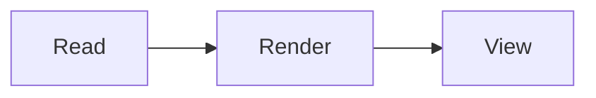
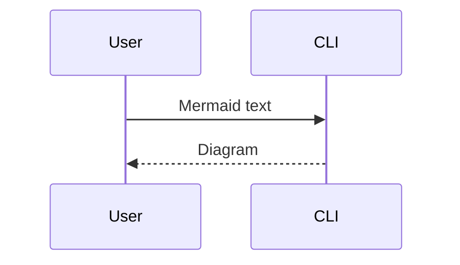

# m2rd

[](https://github.com/yowainwright/m2rd/actions/workflows/test.yml)
[](https://github.com/yowainwright/m2rd/actions/workflows/gh-pages.yml)
[](LICENSE)

m2rd, mermaid to react diagram, is built to help users render mermaid as different image formats as both a cli and via a web app.

Mermaid is the source of truth.
m2rd provides a web app, which provides a mermaid editor and the diagram.
In the terminal, it provides a cli which renders diagrams via a tui.

---

## usage

To use the web app, just go to https://jeffry.in/m2rd/.
That's my person site; all posted in Github if you're curious.

You can use it locally if you would like by cloning the project, running install, and run dev.
See the [npm scripts](https://github.com/yowainwright/m2rd/blob/main/package.json#L21-L65) if you want the exact scripts.

```sh
mise install
pnpm install
pnpm run dev
```

To use the cli, pipe the mermaid content in and lets m2rd take care of the rest.

```sh
brew install yowainwright/tap/m2rd
```

Then run

```sh
printf 'flowchart LR\n  A[Hello] --> B[m2rd]\n' | m2rd
```

You will observe a basic mermaid chart in the Terminal.

That's it!

---

## CLI API

### `m2rd [files...]`

> Type: **`file paths or stdin`**
> Default: **`stdin`**

View Mermaid text or the fenced `mermaid` blocks in Markdown files. Run the viewer in an interactive terminal.

#### Pipe Mermaid text

```sh
printf 'flowchart LR\n  A[Read] --> B[Render] --> C[View]\n' | m2rd
```

#### Read a Markdown file

Save this as `example.md`:

````markdown
# Example diagrams




````

Then open it:

```sh
m2rd example.md
```

Use `n` for the next diagram, `p` for the previous one, and `q` to quit. Arrow keys or `h/j/k/l` scroll the current diagram.

You can also pipe the Markdown:

```sh
cat example.md | m2rd
```

#### Read multiple Markdown files

```sh
m2rd example.md another.md
m2rd docs/*.md
```

Files and diagrams appear in order, one diagram at a time. Markdown files without Mermaid blocks are skipped.

## Site structure

The repository root is the Next.js application.

```text
app/                  Next.js routes and application source
app/components/       Workspace UI, React Flow canvas, and shadcn UI
app/lib/              Shared utilities and observability
app/graph/             Graph model, translation, layout, and persistence
app/export/            Image and diagram export
tests/                Unit, integration, and end-to-end tests
```

## License

[MIT](./LICENSE)
